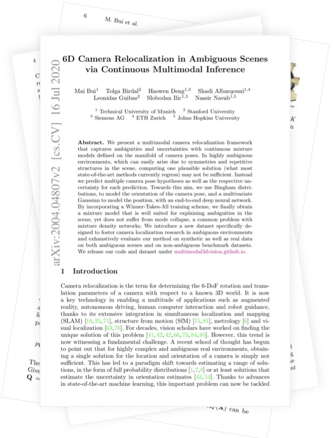
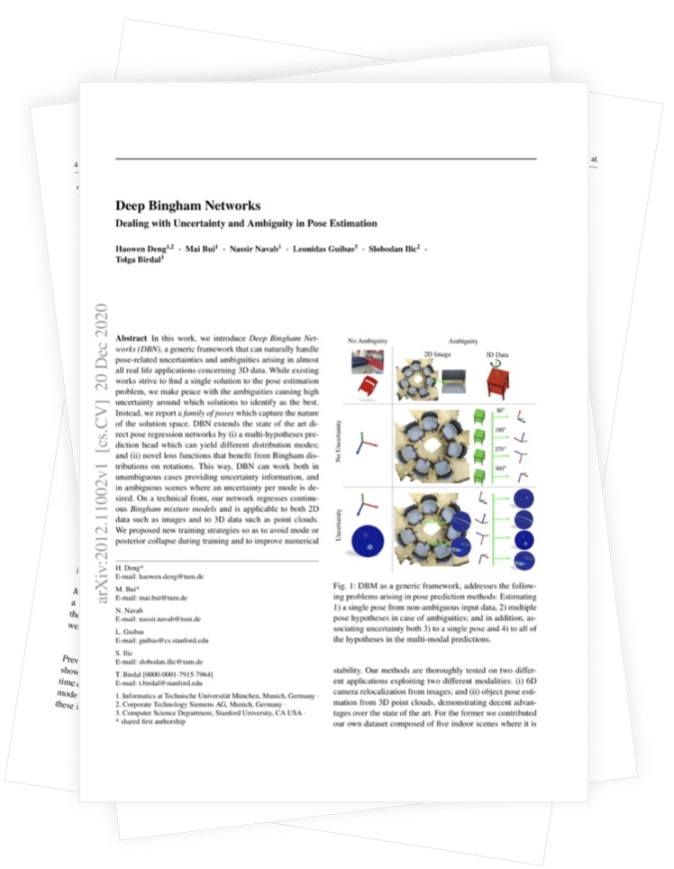
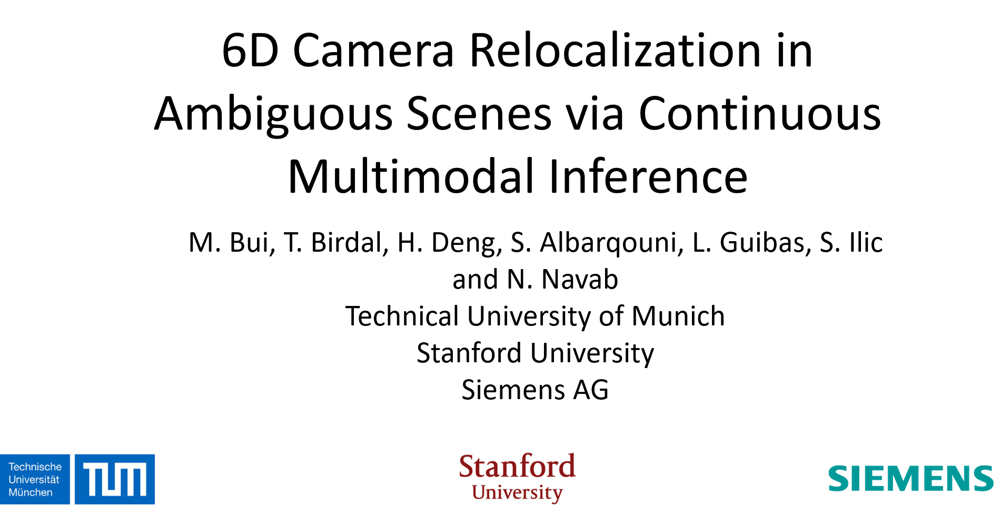

# Multimodal Inference for 6D Camera Relocalization and Object Pose Estimation

[Mai Bui](http://campar.in.tum.de/Main/MaiBui), [Tolga Birdal](http://tbirdal.me/), [Haowen Deng](http://campar.in.tum.de/Main/HaowenDeng),  [Shadi Albarqouni](http://campar.in.tum.de/Main/ShadiAlbarqouni), [Leonidas Guibas](https://profiles.stanford.edu/leonidas-guibas) , [Slobodan Ilic](http://campar.in.tum.de/Main/SlobodanIlic) & [Nassir Navab](http://campar.in.tum.de/WebHome)

[Stanford University](http://www.stanford.edu) & [Technical University of Munich](http://www.tum.de) & Siemens AG


In a highly ambiguous environment, similar looking views can easily confuse current camera pose regression models and lead to incorrect localization
results. Instead, given a query RGB image, our aim is to predict the possible modes as well as the associated uncertainties, which we model by the parameters
of Bingham and Gaussian mixture models.

## Abstract
We present a multimodal camera relocalization framework that captures ambiguities and uncertainties with continuous mixture models defined on the manifold of camera poses. In highly ambiguous environments, which can easily arise due to symmetries and repetitive structures in the scene, computing one plausible solution (what most state-of-the-art methods currently regress) may not be sufficient. Instead we predict multiple camera pose hypotheses as well as the respective uncertainty for each prediction. Towards this aim, we use Bingham distributions, to model the orientation of the camera pose, and a multivariate Gaussian to model the position, with an end-to-end deep neural network. By incorporating a Winner-Takes-All training scheme, we finally obtain a mixture model that is well suited for explaining ambiguities in the scene, yet does not suffer from mode collapse, a common problem with mixture density networks. We introduce a new dataset specifically designed to foster camera localization research in ambiguous environments and exhaustively evaluate our method on synthetic as well as real data on both ambiguous scenes and on non-ambiguous benchmark datasets.

## Results
We created a synthetic dataset, that is specifically designed to contain repetitive structures and introduce highly ambiguous viewpoints. 


In addition, we create highly ambiguous real scenes using Google Tango and a graph-based SLAM approach. We acquire RGB images as well as distinct ground truth camera trajectories for training and testing. 

In comparison to current state-of-the-art methods, the proposed model is able to capture plausible, but diverse modes as well as associated uncertainties for each pose hypothesis. 


## Resources
### Publications
<p align="center">
  <div class="special-class" markdown="1">
<p><a href="https://arxiv.org/abs/2004.04807">
  
 </a>
<a href="https://arxiv.org/abs/2012.11002">
  
 </a>&nbsp;&nbsp;
    <a href="https://github.com/Multimodal3DVision/torch_bingham">
  
 </a>&nbsp;&nbsp;&nbsp;&nbsp;
    <a href="http://campar.in.tum.de/files/AmbiguousRelocDataset/Ambiguous_ReLoc_Dataset.zip">
  
 </a>
    </p>
</div>
  
</p>

<!--More information and details can be found in our [paper](https://arxiv.org/abs/2004.04807 "Paper").-->

<!--The link for downloading our ambiguous relocalization dataset is available [here](http://campar.in.tum.de/files/AmbiguousRelocDataset/Ambiguous_ReLoc_Dataset.zip).

<!--### Source Code
<!--The implementation of our work can be found [here](https://github.com/Multimodal3DVision/torch_bingham).

## Video
<!--<a href="https://www.youtube.com/watch?v=SCKwR1uvNmM&feature=youtu.be" target="_blank"></a>-->
 <iframe width="850" height="478" src="https://www.youtube.com/embed/SCKwR1uvNmM" frameborder="0" allow="accelerometer; autoplay; encrypted-media; gyroscope; picture-in-picture" allowfullscreen></iframe>

## Citation
```
@inproceedings{bui2020eccv,
  title={6D Camera Relocalization in Ambiguous Scenes via Continuous Multimodal Inference},
  author={Bui, Mai and Birdal, Tolga and Deng, Haowen and Albarqouni, Shadi and Guibas, Leonidas and Ilic, Slobodan and Navab, Nassir},
  journal={European Conference on Computer Vision (ECCV)},
  year={2020}
}

@misc{deng2020deep,
      title={Deep Bingham Networks: Dealing with Uncertainty and Ambiguity in Pose Estimation}, 
      author={Haowen Deng and Mai Bui and Nassir Navab and Leonidas Guibas and Slobodan Ilic and Tolga Birdal},
      year={2020},
      eprint={2012.11002},
      archivePrefix={arXiv},
      primaryClass={cs.CV}
}
```

## Funding 
This joint effort is supported by [BaCaTec](http://www.bacatec.de/en/index.html), the Bavaria California Technology Center. 

## Interested in Collaborating with Us?
We would like this project to evolve towards a repository of methods for handling challenging multimodal problems of 3D computer vision. Therefore, we look for contributors and collaborators with great coding and mathematics skills as well as good knowledge in 3D vision, machine (deep) learning.
